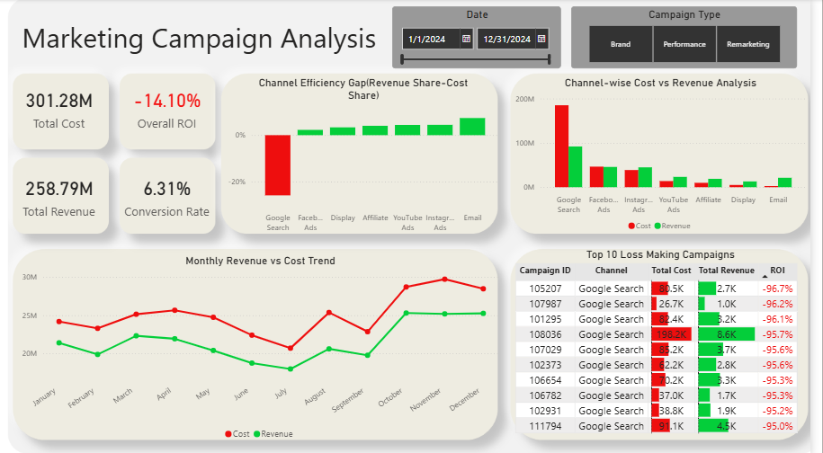

# 📊 Marketing Campaign Performance Analysis

## Overview
This project analyzes multi-channel marketing campaign data to evaluate performance, identify inefficiencies in budget allocation, and improve overall return on investment (ROI). The analysis focuses on uncovering the root causes of losses and providing actionable business recommendations.

---

## Objectives
- Analyze channel-wise marketing performance  
- Identify loss-making campaigns and their impact  
- Evaluate ROI distribution and performance variation  
- Understand cost vs revenue contribution across channels  
- Provide data-driven recommendations for budget optimization  

---

## Tools & Technologies
- SQL (MySQL) – Data extraction and analysis  
- Power BI – Data visualization and dashboarding  
- Excel – Data handling and preprocessing  

---

## Dataset
- Synthetic dataset simulating real-world marketing campaigns  
- ~12,000 records  
- Includes metrics such as impressions, clicks, conversions, cost, revenue, ROI  

---

## Key Insights

- **Google Search inefficiency:**  
  Consumed ~61% of total budget but contributed only ~35% of revenue, resulting in significant negative ROI  

- **Email channel performance:**  
  Generated disproportionately high ROI due to low cost and targeted audience, though limited in scalability  

- **Cost-driven performance variation:**  
  Conversion rates were consistent across channels (~6%), indicating that ROI differences were driven by cost inefficiencies rather than conversion effectiveness  

- **High-impact loss-making campaigns:**  
  Worst-performing campaigns (ROI below -95%) were concentrated entirely in Google Search, highlighting severe inefficiencies at the campaign level  

- **Budget misallocation:**  
  Several mid-tier channels (Affiliate, Display, YouTube) showed better revenue-to-cost ratios, indicating opportunity for optimized budget distribution  

---

## Dashboard

---

## Key Visuals
- KPI Cards: Revenue, Cost, ROI, Conversion Rate  
- Channel-wise Revenue vs Cost Comparison  
- Channel Efficiency Gap (Revenue % - Cost %)  
- Monthly Revenue vs Cost Trend  
- Top 10 Loss-Making Campaigns  

---

## Business Recommendations
- Reallocate budget from underperforming channels (e.g., Google Search) to more efficient channels  
- Optimize keyword targeting and bidding strategies in high-cost channels  
- Leverage successful strategies from high-ROI channels like Email  
- Implement campaign-level monitoring to identify and stop high-loss campaigns early  

---

## Conclusion
The analysis reveals that overall losses are primarily driven by inefficient budget allocation rather than poor conversion performance. By optimizing spend distribution and improving campaign-level strategies, marketing efficiency and ROI can be significantly improved.

---

## Author
**Umesh Harsana**  
B.Tech, IIT(BHU) Varanasi  
Aspiring Data Analyst
